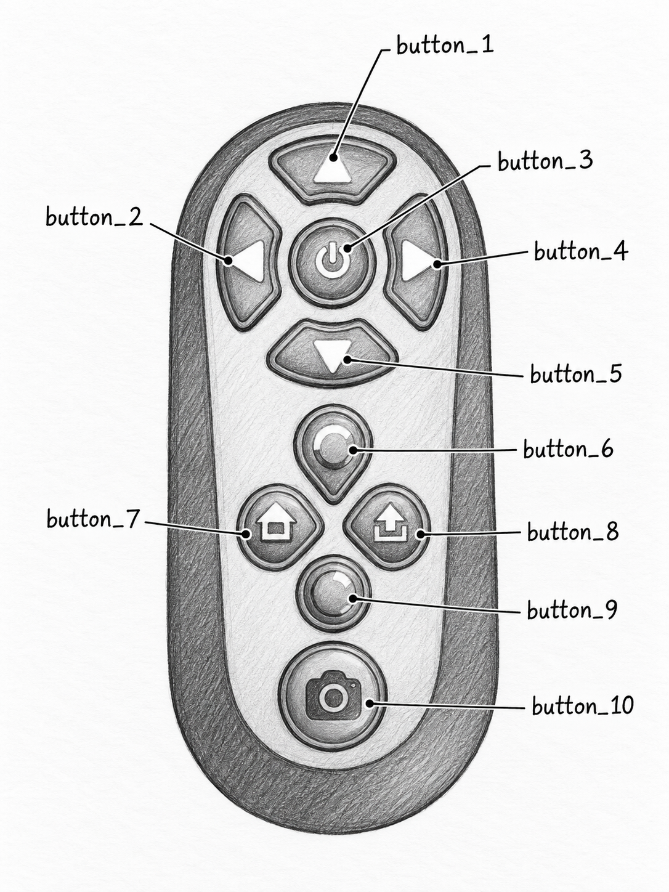

# ESP32 LED Scoreboard

Standalone Arduino firmware for an ESP32-S3 that turns a D18 BLE remote and a
32×16 iPixel BLE LED matrix into a two-team scoreboard.
No phone or PC is needed once the board is flashed: the ESP32 acts as a BLE
central for both devices at the same time, reads gestures from the remote,
renders the scores in RAM, encodes the frame as a PNG, and pushes it to the
panel in a single GATT write.

This is the ESP32 port of the Python scoreboard in the repo root
(`led_scoreboard_v1.py`); it uses the same panel protocol and a similar layout.

```
+--------------------------------+
|                                |
|   1 2            0 7           |   Team 1 = red, x = 0..14
|                                |   Team 2 = blue, x = 17..31
+--------------------------------+
        32 x 16 pixels
```

## Hardware

- ESP32-S3 N16R8 dev board (16 MB flash, 8 MB OPI PSRAM)
- D18 BLE HID remote (touchpad + consumer-control buttons)
- iPixel 32×16 BLE LED panel advertising as `LED_BLE_E1D5E5B2`

## Controls




| D18 gesture / key | Button | Action |
| --- | --- | --- |
| Swipe down | `button_1` | Team 1 +1 |
| Swipe up | `button_5` | Team 1 −1 |
| Swipe left | `button_4` | Team 2 +1 |
| Swipe right | `button_2` | Team 2 −1 |
| Consumer key `40 00` | `button_10` | Double press: reset both scores to `00` |
| Single center tap | `button_3` | Show the D18 battery level for 3 s, then return to the scores |

Scores are clamped to `0–99`. The remaining D18 inputs are decoded but not yet
mapped to an action:

| D18 gesture / key | Button |
| --- | --- |
| Double center tap | `button_9` |
| Consumer key `04 00` | `button_6` |
| Consumer key `00 80` | `button_7` |
| Consumer key `00 40` | `button_8` |

## Building and flashing

Open `scoreboard.ino` in the Arduino IDE with the ESP32 core installed.

**Board settings** (`Tools` menu):

| Setting | Value |
| --- | --- |
| Board | ESP32S3 Dev Module |
| Upload Speed | 921600 |
| USB CDC On Boot | Disabled |
| CPU Frequency | 240 MHz (WiFi) |
| Flash Mode | QIO 80 MHz |
| Flash Size | 16 MB (128 Mb) |
| PSRAM | OPI PSRAM |
| Port | whichever COM port the board enumerates on (has been `COM7`) |

**Libraries:**

- ESP32 Arduino core BLE (`BLEDevice.h`, bundled with the core)
- [PNGenc](https://github.com/bitbank2/PNGenc) by Larry Bank (Library Manager)

Serial monitor runs at **115200** baud.

## Startup sequence

The LED panel is connected first: it is what the board exists to drive, and it
has to be up before a missing remote can be signalled by blinking the scores.
The D18 is only scanned for once the panel is connected.

1. Open the serial monitor, then reset the board.
2. The board scans for `LED_BLE_E1D5E5B2` and connects (MTU 517 requested).
   The panel must be powered on and **not** connected to the iPixel phone app.
3. Brightness is explicitly set to 50 % and the initial `00 – 00` frame is sent.
4. The scores start blinking — the panel is up, the remote is not.
5. Press a button on the remote so it advertises. The board connects, secures
   the link (Just Works pairing) and subscribes to the HID input reports.
6. The blink stops and the scores go back to displaying normally.

The panel advertises continuously, so step 2 succeeds as soon as it is powered
and free. The D18 only advertises for a short window after a button press,
which is why it is scanned for continuously - in the background, so the flash
keeps its rhythm - for as long as it is missing.

On success you will see:

```
============================================
BOTH BLE DEVICES CONNECTED
button_1 = Team 1 +1
button_5 = Team 1 -1
button_4 = Team 2 +1
button_2 = Team 2 -1
button_10 x2 = reset both to 00 (double press)
button_8 = brightness up
button_7 = brightness down
button_3 = show D18 battery level
============================================
```

Every 5 seconds the loop prints a status line:

```
STATUS | D18: CONNECTED | LED: CONNECTED | T1: 3 | T2: 1
```

## Automatic reconnection

Both links are checked on every pass of `loop()`. If either one is down the
board scans for it and tries to connect — the panel first (a blocking scan, 5 s
per attempt, `Config::BLE_SCAN_SECONDS`), then the D18. A failed attempt simply
retries on the next pass, forever, so the board never needs a reset:

- **D18 drops** — the board prints `D18 DISCONNECTED. Press a button on the
  remote to reconnect.` and keeps scanning. The D18 scan is the one scan that
  does not block: `D18Remote::startScan()` starts it and returns, `loop()` goes
  on flashing the panel, and `D18Remote::foundRemote()` reports when it has
  something. Only then does the board block, for the connect itself
  (`connectToFoundRemote()`). A scan that expires is simply restarted. Press
  any button on the remote so it advertises again; the link is re-secured from
  the stored bond and the HID reports are re-subscribed.
- **LED drops** — the board prints `LED DISCONNECTED. Reconnecting...` and
  keeps scanning. As soon as the panel is back it re-sends the brightness and
  the current scores, which are kept in RAM the whole time. The blink stops
  while the panel is gone; there is nothing to blink on.
- **Both down** — the panel is scanned for first, and a round that cannot reach
  it does not scan for the D18 at all: without a display there is nothing to
  show and nothing to blink, so the next round goes back to the panel. Any
  background D18 scan is cancelled before an LED attempt, because both share
  one `BLEScan` object and the LED scan blocks.

Scores are never lost by a disconnect; button presses that arrive while the
LED is being reconnected are queued and applied once the loop resumes.

### Blinking while the remote is missing

Whenever the panel is connected but the D18 is not — at startup and after the
remote drops — the scores blink on and off so it is obvious from across the
room that the board is not taking button presses yet. `Scoreboard::tick()`
alternates the score frame with an empty one every `FLASH_MS` (300 ms, top of
`Scoreboard.cpp`), and `Scoreboard::setBlinking(false)` stops the flashing the
moment the remote is connected.

`tickBlink()` neither blocks nor delays: it flips the frame when the current
half is up and returns. That only works because nothing else in the loop
blocks for long while the panel is flashing — this is why the D18 is scanned
for in the background. A blocking scan froze the flash for its whole length,
which is what an uneven, second-long blink was.

**The panel sets the floor on the flash rate.** It drops an image write that
arrives too soon after the one before it, ACKing on FA03 with a status of `00`
instead of `03`, or not at all. 300 ms is comfortable; a 90 ms flash made it
drop roughly every second frame, and because the drops landed on the lit half
the panel sat black. If you shorten `FLASH_MS`, watch the ACK statuses on the
serial monitor. A dropped frame now costs only one half of one flash — the
next toggle is already on its way — instead of leaving the panel dark.

Flash frames are built and sent with logging suppressed (the `quiet` argument
on `LedImagePacket::build()` and `LedDisplay::sendImagePacket()`) - otherwise
the packet dumps bury the rest of the log. Errors still log, and a failed
write also ends the burst so the loop can go reconnect the panel.

## Module layout

The sketch is split into one class per file:

| File | Responsibility |
| --- | --- |
| `scoreboard.ino` | Wires the modules together; `setup()` connection sequence and `loop()` |
| `Config.h` | Shared constants: device names, panel geometry, brightness range, buffer sizes |
| `Font.h/.cpp` | 7×14 bitmap glyphs for digits `0`–`9` and `%` |
| `Framebuffer.h/.cpp` | 32×16 RGB888 pixel buffer with `clear`, `fill`, `setPixel`, `drawDigit`, and a serial dump |
| `PngImage.h/.cpp` | Encodes a `Framebuffer` to an in-RAM PNG with PNGenc |
| `LedImagePacket.h/.cpp` | Wraps a PNG in the panel's proprietary `0x0002` "show image" packet (length, CRC32, buffer number) |
| `LedDisplay.h/.cpp` | BLE client for the LED panel: scan, connect, MTU, brightness, single-write image send, ACK notifications |
| `D18Remote.h/.cpp` | BLE HID client for the D18: scan, connect, secure, subscribe to input reports, decode touchpad gestures and consumer keys into button numbers |
| `RemoteBattery.h/.cpp` | Reads the D18 charge level over the standard BLE Battery Service (`0x180F` / `0x2A19`) on the existing D18 link |
| `BatteryScreen.h/.cpp` | Draws a battery percentage (digits + `%`) centered on a `Framebuffer`, green / yellow / red by charge; sets how long it stays up (`SHOW_MS`) |
| `Scoreboard.h/.cpp` | Owns the two scores and the display pipeline; maps button numbers to score changes; hosts temporary screens (battery) and restores the scores when they expire; blinks the scores while the remote is missing |

### Display pipeline

```
scores -> Framebuffer -> PngImage -> LedImagePacket -> LedDisplay (one GATT write)
```

`Scoreboard::update()` runs the whole chain. The 32×16 frame compresses to a
few hundred bytes, so it fits inside the negotiated MTU and the panel redraws
instantly. `LedDisplay::sendImagePacket()` refuses any packet larger than the
MTU payload rather than letting the BLE stack split it into a prepared/long
write, which the panel does not accept.

### Image packet format

| Bytes | Field |
| --- | --- |
| 0–1 | Total packet length, LE16 |
| 2–3 | Command `0x0002`, LE16 |
| 4 | `0x00` |
| 5–8 | PNG byte length, LE32 |
| 9–12 | CRC32 of the PNG bytes, LE32 |
| 13 | `0x00` |
| 14 | Buffer number |
| 15… | PNG data |

Brightness uses a separate 5-byte command: `05 00 04 80 XX`, where `XX` is the
percentage (`0x0A`–`0x64` for 10–100 %).

### D18 input handling

HID notifications arrive on the BLE host task. `D18Remote` copies each report
into a FreeRTOS queue and returns immediately; `D18Remote::update()` drains the
queue from `loop()`, so button handlers (and the LED GATT writes they trigger)
always run on the main loop, never inside a BLE callback.

- **Report ID 1 (consumer control):** 2-byte key codes mapped directly to
  `button_6/7/8/10`.
- **Report ID 2 (touchpad):** absolute X/Y plus a touch bit. A swipe is
  ≥ 250 units along the dominant axis; a tap is ≤ 120 units of travel starting
  in the center region (X 400–600, Y 300–500). Two center taps within 450 ms
  are a double tap (`button_9`); otherwise a single tap (`button_3`) fires once
  the window expires.

Gesture thresholds live at the top of `D18Remote.cpp`.

### Battery screen

`button_3` reads the D18's Battery Level characteristic (one blocking GATT
read on the main loop, a few tens of ms) and `Scoreboard::showBattery()` pushes
the percentage through the same framebuffer → PNG → packet pipeline. The
number is followed by a `%` glyph, centered with no leading zeros, and colored green (≥ 50 %), yellow
(20–49 %) or red (< 20 %). `Scoreboard::tick()`, called from `loop()`, re-sends
the scores after `BatteryScreen::SHOW_MS` (3 s); any score change in the
meantime restores them immediately. If the remote is disconnected or does not
expose the Battery Service the read is logged and the scores stay on the panel.

## GATT identifiers

| Device | UUID | Purpose |
| --- | --- | --- |
| LED panel | `000000fa-0000-1000-8000-00805f9b34fb` | Service |
| LED panel | `0000fa02-…` | Write (commands and image packets) |
| LED panel | `0000fa03-…` | Notify (ACKs) |
| D18 | `0x1812` | HID service |
| D18 | `0x2A4D` | Report characteristic |
| D18 | `0x2908` | Report Reference descriptor (report ID + type) |
| D18 | `0x180F` | Battery Service |
| D18 | `0x2A19` | Battery Level characteristic (0–100 %) |

## Configuration

`Config.h`:

| Name | Default | Meaning |
| --- | --- | --- |
| `LED_NAME` | `LED_BLE_E1D5E5B2` | Panel advertised name |
| `D18_NAME` | `D18` | Remote advertised name |
| `BLE_SCAN_SECONDS` | `5` | Length of one scan attempt (a blocking LED scan, or one slice of the restarted background D18 scan) |
| `BRIGHTNESS_DEFAULT` | `50` | Brightness sent at startup (%) |
| `BRIGHTNESS_STEP` / `MIN` / `MAX` | `10` / `10` / `100` | Brightness adjustment range |
| `DISPLAY_WIDTH` × `DISPLAY_HEIGHT` | `32` × `16` | Panel resolution |
| `PNG_BUFFER_SIZE` | `4096` | Max encoded PNG size |
| `LED_HEADER_SIZE` | `15` | Bytes before the PNG in an image packet |

Layout (digit positions, colors, gap) is at the top of `Scoreboard.cpp`.

## Notes

- **Include order matters.** PNGenc's `zutil.h` does `#define local static`,
  which breaks NimBLE's `ble_sm.h` (it has a struct field named `local`).
  Always include the BLE headers before `PngImage.h`; `PngImage.h` also
  `#undef`s `local` after including PNGenc.
- `Scoreboard`, `PngImage`, and `LedImagePacket` hold roughly 10 KB of buffers
  and PNGenc state. Keep them global, not on the stack.
- `Scoreboard::testSolidRedFrame()` fills the panel solid red; useful for
  checking the send path independently of the font and layout.

## Troubleshooting

- **`D18 not found.`** repeating — the remote isn't advertising during the
  scan. Press a remote button; the board keeps scanning until it sees it.
- **`LED not found.`** repeating — the panel is off, out of range, or still
  connected to the phone app. Close the app; the board keeps scanning.
- **`SEND ERROR: packet exceeds negotiated MTU.`** — MTU negotiation failed
  (check the `LED MTU negotiation` line) or the PNG is unusually large.
- **Frame sent, `LED ACK` received, but nothing changes** — try a different
  buffer number in `LedImagePacket.cpp`.
- **Stuck on `Securing D18 connection...`** — `BLEClient::secureConnection()`
  waits for an encryption event with no timeout, so anything that stops the
  pairing from finishing freezes the loop (and the flash) until the remote
  disconnects. `BLESecurity` tracks "security started" in a single global flag
  that is only cleared when a link drops, so an LED connect used to be able to
  claim it, after which the D18's pairing request was never sent and the wait
  could never end. The sketch now calls
  `BLESecurity::setForceAuthentication(false)` in `setup()` (only the D18 link
  ever pairs, and only when `D18Remote::connect()` asks) and
  `BLESecurity::resetSecurity()` right before securing. If it still hangs,
  power-cycle the remote: the disconnect releases the wait and the next attempt
  pairs normally.
